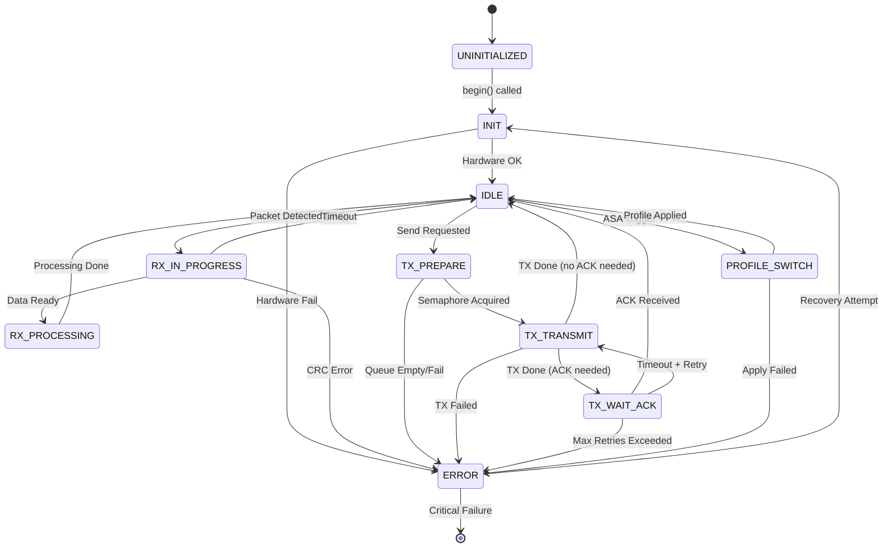

# LoRa FSM Design - Detailed State Machine

## State Transition Diagram (Mermaid)



## State Definitions

### UNINITIALIZED (0)
**Description**: Initial state before hardware initialization

**Entry Actions**:
- Set all flags to default values
- Clear queues

**Exit Actions**:
- None

**Valid Transitions**:
- → INIT (on begin() call)

---

### INIT (1)
**Description**: Hardware configuration and initialization

**Entry Actions**:
- Configure SPI pins (SCK, MISO, MOSI, SS, RST, DIO1, BUSY)
- Initialize SX1262 via RadioLib
- Set default profile (profile 0: SF12/125kHz)
- Create FreeRTOS queues (incoming, outgoing)
- Create semaphores (radio, pending, log)
- Start receiver task

**Exit Actions**:
- Log initialization result

**Valid Transitions**:
- → IDLE (if all OK)
- → ERROR (if any step fails)

**Timeout**: 5 seconds

---

### IDLE (2)
**Description**: Normal operation, listening for packets and ready to transmit

**Entry Actions**:
- Set receivingInProgress = false
- Call radio.startReceive()
- Check outgoingQueue

**Exit Actions**:
- None

**Valid Transitions**:
- → RX_IN_PROGRESS (RadioLib IRQ: packet detected)
- → TX_PREPARE (outgoingQueue not empty and !receivingInProgress)
- → PROFILE_SWITCH (ASA triggers profile change)

**Periodic Actions**:
- Check bulk ACK timeout
- Process pending sends (retry logic)
- Update statistics

---

### RX_IN_PROGRESS (3)
**Description**: Receiving a packet from the air

**Entry Actions**:
- Set receivingInProgress = true
- Block TX operations

**Exit Actions**:
- Set receivingInProgress = false

**Valid Transitions**:
- → RX_PROCESSING (radio.readData() success)
- → ERROR (CRC error from RadioLib)
- → IDLE (timeout - no data)

**Timeout**: Depends on current profile (50ms for FSK, 2000ms for LoRa SF12)

---

### RX_PROCESSING (4)
**Description**: Parsing and handling received packet

**Entry Actions**:
- Parse packet header (senderId, receiverId, packetType, packetId, payloadLen)
- Validate packet integrity
- Check if packet is for us (receiverId == myDeviceId or broadcast)
- Check for duplicate packetId
- Add to incomingQueue

**Exit Actions**:
- If ACK required: add to bulk ACK buffer or send single ACK
- Update lastPacketReceived timestamp
- Update RSSI/SNR statistics
- Log packet details

**Valid Transitions**:
- → IDLE (always after processing)

**Processing Time**: < 10ms typical

---

### TX_PREPARE (5)
**Description**: Preparing packet for transmission

**Entry Actions**:
- Check if receivingInProgress (if yes, wait)
- Acquire radioSemaphore (timeout 1000ms)
- Get packet from outgoingQueue
- Serialize packet (header + payload)
- Calculate CRC if needed

**Exit Actions**:
- None

**Valid Transitions**:
- → TX_TRANSMIT (packet ready)
- → ERROR (semaphore timeout or serialization fail)

**Timeout**: 1 second

---

### TX_TRANSMIT (6)
**Description**: Transmitting packet via RadioLib

**Entry Actions**:
- Call radio.transmit(buffer, length)
- Wait for RadioLib to complete
- Record transmission timestamp

**Exit Actions**:
- Release radioSemaphore
- Update TX statistics

**Valid Transitions**:
- → IDLE (if TX OK and !waitForAck)
- → TX_WAIT_ACK (if TX OK and waitForAck)
- → ERROR (if TX failed)

**Typical Duration**: 
- FSK 100kbps: ~10ms
- LoRa SF7: ~50ms
- LoRa SF12: ~2000ms

---

### TX_WAIT_ACK (7)
**Description**: Waiting for acknowledgment

**Entry Actions**:
- Add packet to pending list
- Set timeout = currentRetryTimeoutMs
- Start timeout timer

**Exit Actions**:
- Remove packet from pending list (if ACK received)
- Update ACK statistics

**Valid Transitions**:
- → IDLE (ACK received)
- → TX_TRANSMIT (timeout + retries < maxRetries)
- → ERROR (timeout + retries >= maxRetries)

**Timeout**: Adaptive (1500-8500ms depending on profile)

**Retry Logic**:
```cpp
if (ack_received) {
    goto IDLE;
} else if (millis() - timestamp > timeout) {
    retries++;
    if (retries < maxRetries) {
        goto TX_TRANSMIT;
    } else {
        log_error("Max retries exceeded");
        goto ERROR;
    }
}
```

---

### ERROR (8)
**Description**: Error state with recovery attempts

**Entry Actions**:
- Log error details (state, error code, timestamp)
- Increment error counter
- Release all semaphores
- Clear pending operations

**Exit Actions**:
- Reset error-specific flags

**Valid Transitions**:
- → INIT (if error_count < 3, attempt recovery)
- → HALT (if error_count >= 3, critical failure)

**Error Types**:
- RADIO_INIT_FAIL
- TX_FAIL
- RX_CRC_ERROR
- SEMAPHORE_TIMEOUT
- PROFILE_SWITCH_FAIL
- QUEUE_OVERFLOW

**Recovery Strategy**:
1. Log error
2. Wait 1 second
3. Attempt re-initialization
4. If 3 consecutive failures → halt

---

### PROFILE_SWITCH (9)
**Description**: Switching LoRa/FSK profile

**Entry Actions**:
- Stop receiver task
- Acquire radioSemaphore
- Apply new profile (SF, BW, CR or bitrate, deviation)
- Update adaptive parameters (timeout, retries)
- Restart receiver

**Exit Actions**:
- Release radioSemaphore
- Log profile change

**Valid Transitions**:
- → IDLE (profile applied successfully)
- → ERROR (profile application failed)

**Timeout**: 500ms

**Rollback**: If profile application fails, revert to previous profile

---

## Event Definitions

| Event Code | Name | Trigger | Parameters |
|------------|------|---------|------------|
| 0x00 | EVT_NONE | No event | - |
| 0x01 | EVT_INIT_OK | Hardware initialized | - |
| 0x02 | EVT_INIT_FAIL | Hardware init failed | error_code |
| 0x10 | EVT_RX_START | RadioLib IRQ | - |
| 0x11 | EVT_RX_DONE | Data available | length |
| 0x12 | EVT_RX_TIMEOUT | No data received | - |
| 0x13 | EVT_RX_CRC_ERROR | CRC mismatch | - |
| 0x20 | EVT_TX_REQUEST | User calls send() | packet |
| 0x21 | EVT_TX_DONE | Transmission complete | - |
| 0x22 | EVT_TX_FAIL | Transmission failed | error_code |
| 0x30 | EVT_ACK_RECEIVED | ACK packet parsed | packetId |
| 0x31 | EVT_ACK_TIMEOUT | No ACK in time | packetId |
| 0x40 | EVT_PROFILE_SWITCH | ASA or manual | profileIndex |
| 0x41 | EVT_PROFILE_OK | Profile applied | - |
| 0x42 | EVT_PROFILE_FAIL | Profile failed | error_code |
| 0xFF | EVT_ERROR_RECOVERY | Attempting recovery | - |

---

## State Transition Table

| Current State | Event | Next State | Actions |
|---------------|-------|------------|---------|
| UNINITIALIZED | EVT_INIT_OK | INIT | Configure hardware |
| INIT | EVT_INIT_OK | IDLE | Start receiver |
| INIT | EVT_INIT_FAIL | ERROR | Log error |
| IDLE | EVT_RX_START | RX_IN_PROGRESS | Set flag, block TX |
| IDLE | EVT_TX_REQUEST | TX_PREPARE | Get packet from queue |
| IDLE | EVT_PROFILE_SWITCH | PROFILE_SWITCH | Stop RX, apply profile |
| RX_IN_PROGRESS | EVT_RX_DONE | RX_PROCESSING | Parse packet |
| RX_IN_PROGRESS | EVT_RX_TIMEOUT | IDLE | Clear flag |
| RX_IN_PROGRESS | EVT_RX_CRC_ERROR | ERROR | Log CRC error |
| RX_PROCESSING | (done) | IDLE | Add to queue, send ACK |
| TX_PREPARE | (ready) | TX_TRANSMIT | Serialize packet |
| TX_PREPARE | (fail) | ERROR | Log failure |
| TX_TRANSMIT | EVT_TX_DONE | IDLE or TX_WAIT_ACK | Check if ACK needed |
| TX_TRANSMIT | EVT_TX_FAIL | ERROR | Log TX error |
| TX_WAIT_ACK | EVT_ACK_RECEIVED | IDLE | Remove from pending |
| TX_WAIT_ACK | EVT_ACK_TIMEOUT | TX_TRANSMIT or ERROR | Retry or fail |
| PROFILE_SWITCH | EVT_PROFILE_OK | IDLE | Restart RX |
| PROFILE_SWITCH | EVT_PROFILE_FAIL | ERROR | Rollback profile |
| ERROR | EVT_ERROR_RECOVERY | INIT | Re-initialize |
| ERROR | (critical) | HALT | System halt |

---

## FSM Implementation Example

```cpp
class LoRaFSM {
public:
    LoRaState currentState = LoRaState::UNINITIALIZED;
    
    void processEvent(LoRaEvent event, void* data = nullptr) {
        LoRaState nextState = getNextState(currentState, event);
        
        if (nextState != currentState) {
            exitState(currentState);
            log("FSM: %s + %s -> %s", 
                stateName(currentState), 
                eventName(event), 
                stateName(nextState));
            currentState = nextState;
            enterState(nextState, data);
        }
    }
    
private:
    LoRaState getNextState(LoRaState state, LoRaEvent event) {
        // Transition table lookup
        switch (state) {
            case LoRaState::IDLE:
                if (event == LoRaEvent::EVT_RX_START) 
                    return LoRaState::RX_IN_PROGRESS;
                if (event == LoRaEvent::EVT_TX_REQUEST) 
                    return LoRaState::TX_PREPARE;
                // ... etc
            // ... other states
        }
        return state; // no transition
    }
    
    void enterState(LoRaState state, void* data) {
        // Entry actions for each state
        switch (state) {
            case LoRaState::IDLE:
                receivingInProgress = false;
                radio.startReceive();
                break;
            case LoRaState::RX_IN_PROGRESS:
                receivingInProgress = true;
                break;
            // ... etc
        }
    }
    
    void exitState(LoRaState state) {
        // Exit actions for each state
    }
};
```

---

## Logging Format

Every state transition should be logged:

```
[timestamp_ms] [FSM] STATE_FROM + EVENT -> STATE_TO [extra_info]
```

Examples:
```
[1234] [FSM] IDLE + EVT_RX_START -> RX_IN_PROGRESS
[1250] [FSM] RX_IN_PROGRESS + EVT_RX_DONE -> RX_PROCESSING [len=45]
[1255] [FSM] RX_PROCESSING -> IDLE [packetId=12, type='C']
[1300] [FSM] IDLE + EVT_TX_REQUEST -> TX_PREPARE [packetId=13]
[1305] [FSM] TX_PREPARE -> TX_TRANSMIT [to=0x02]
[1320] [FSM] TX_TRANSMIT + EVT_TX_DONE -> TX_WAIT_ACK [timeout=3200ms]
[1350] [FSM] TX_WAIT_ACK + EVT_ACK_TIMEOUT -> TX_TRANSMIT [retry=1/4]
[1365] [FSM] TX_TRANSMIT + EVT_TX_DONE -> TX_WAIT_ACK [timeout=3200ms]
[1400] [FSM] TX_WAIT_ACK + EVT_ACK_RECEIVED -> IDLE [success]
```

---

## Testing Strategy

### Unit Tests:
1. State transitions (all valid paths)
2. Event handling (all events)
3. Error recovery
4. Timeout handling

### Integration Tests:
1. Two devices: Ping-Pong
2. Profile switching during transmission
3. Bulk ACK aggregation
4. Retry logic under packet loss
5. ASA adaptation under varying RSSI

### Stress Tests:
1. 1000 packets back-to-back
2. Random packet loss (0-50%)
3. Rapid profile switches
4. Queue overflow scenarios

---

## Performance Metrics

Track these for each state:

| Metric | Target | Critical |
|--------|--------|----------|
| IDLE → RX_IN_PROGRESS | < 1ms | < 5ms |
| RX_PROCESSING time | < 10ms | < 50ms |
| TX_PREPARE → TX_TRANSMIT | < 20ms | < 100ms |
| PROFILE_SWITCH duration | < 200ms | < 500ms |
| ERROR → INIT recovery | < 2s | < 5s |

---

## Known Issues & Future Work

### Current Issues:
- No explicit timeout handling for stuck states
- Error state doesn't differentiate error severity
- No dead reckoning for RSSI prediction

### Future Enhancements:
- SLEEP state for power saving
- MESH_RELAY state for multi-hop
- CALIBRATION state for auto-tuning
- Encrypted state (AES encryption layer)

---

## Revision History

| Version | Date | Changes |
|---------|------|---------|
| 0.1 | 2025-11-26 | Initial draft |
| 1.0 | TBD | Finalized after testing |
